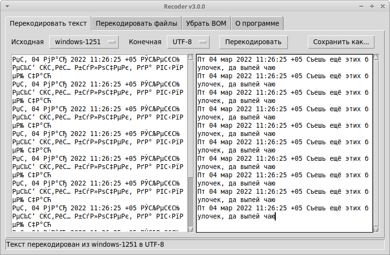
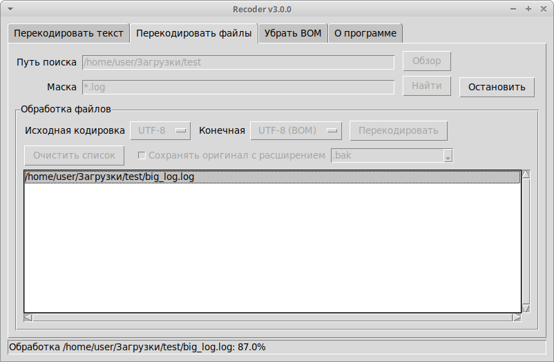

# Recoder v3
Небольшая программа для массового (пакетного) перекодирования файлов из одной кодировки в другую.

[Основная страница программы](https://anton-pribora.ru/recoder/)





## Запуск из исходного кода

Установите пакет виртуального окружения python-venv (не ниже версии 3.8):

```bash
apt install python3-venv python3-tk
```

Склонируйте репозиторий, разверните виртуальное окружение и установите дополнительные
пакеты:

```bash
git clone https://github.com/anton-pribora/py-recoder.git recoder
cd recoder
python3 -m venv venv
./venv/bin/pip install tkinterdnd2
```

Теперь приложение можно запустить с помощью команды:

```bash
./venv/bin/python3 main_tk.py
```

## Компиляция

Для сборки проекта в исполняемый файл перейдите в директорию проекта и выполните:

```bash
./venv/bin/pip install pyinstaller
```

Скомпилируйте исполняемый файл:

```bash
./venv/bin/pyinstaller -F -n recoder-v3-1-0 main_tk.py --collect-all tkinterdnd2 --windowed
```

Если компиляция завершилась без ошибок, исполняемый файл будет доступен в папке `dist`.

Некоторые антивирусы (например, VirusTotal) могут показывать наличие вирусов. Это связано с использованием PyInstaller и
его модулей. Если это является проблемой, то проект можно запускать из исходного кода.